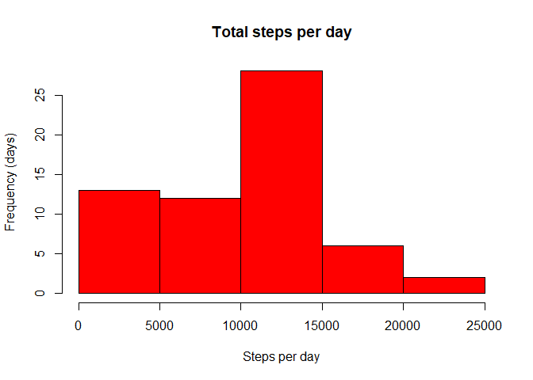
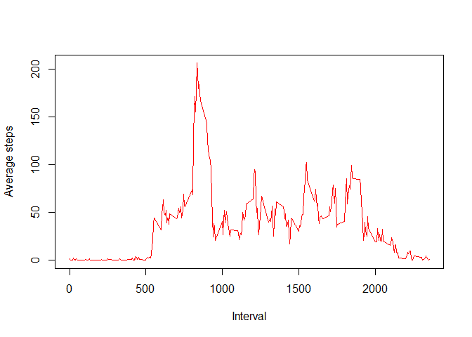
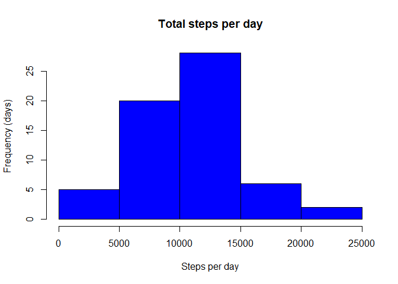
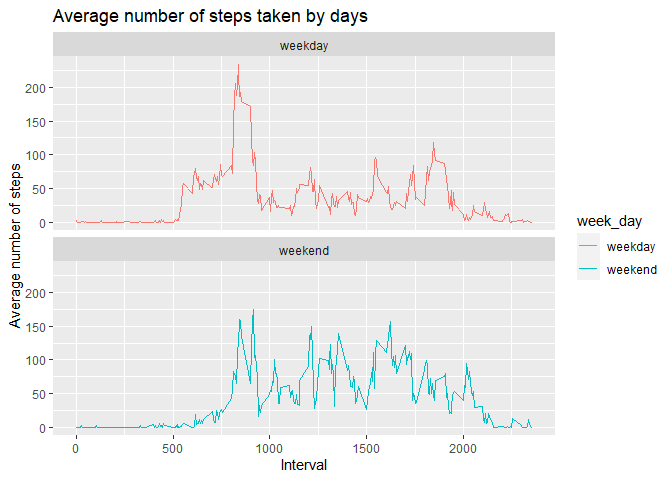

## Loading and preprocessing the data
1. Leer la infromación.
2. Cambiamos la fecha con as.POSIxt

```r
library(ggplot2)
```

```
## Warning: package 'ggplot2' was built under R version 4.0.3
```

```r
data <- read.csv("activity.csv", sep = ",")

head(data)
```

```
##   steps       date interval
## 1    NA 2012-10-01        0
## 2    NA 2012-10-01        5
## 3    NA 2012-10-01       10
## 4    NA 2012-10-01       15
## 5    NA 2012-10-01       20
## 6    NA 2012-10-01       25
```

```r
data$date <- as.POSIXct(data$date)
```
## What is mean total number of steps taken per day?

1. Obtenemos el total de pasos por día, la media y la mediana.

```r
pasos_por_dia <- aggregate(data$steps, by = list(data$date), sum, na.rm = T )
names(pasos_por_dia) <- c("date", "steps")
prome <- mean(pasos_por_dia$steps)
med <-median(pasos_por_dia$steps)
prome
```

```
## [1] 9354.23
```

```r
med
```

```
## [1] 10395
```
2. Tenemos el siguiente histograma:

```r
hist(pasos_por_dia$steps, main = "Total steps per day", xlab ="Steps per day", ylab = "Frequency (days)",  col = "red")
```

<!-- -->


## What is the average daily activity pattern?

1. Observe la siguiente serie de tiempo:

```r
pasitos <- aggregate(data$steps, by = list(data$interval), mean, na.rm = T)
names(pasitos) <- c("Interval",  "Average.steps")
plot(pasitos$Interval, pasitos$Average.steps, xlab = "Interval", ylab = "Average steps", type = "l", col = "red")
```

<!-- -->

2. Obtenemos el intervalo con el máximo promedio de pasos por día:

```r
pasitos[which.max(pasitos$Average.steps),]$Interval
```

```
## [1] 835
```


## Imputing missing values
1. Calculamos el número total de NAs

```r
sum(is.na(data))
```

```
## [1] 2304
```
2. Estrategia para completar los valores perdidos de "data" con un for loop cambiándolos por los promedios de pasos por intervalos.
3. El nuevo "data_2" no tiene valores perdidos, pues el **for loop** los removió.

```r
data_2 <- data
for(i in 1:nrow(data_2)){
  if(is.na(data_2[i,1])){
    data_2[i,1] <- prome/nrow(pasitos)
  }
}
head(data_2)
```

```
##      steps       date interval
## 1 32.47996 2012-10-01        0
## 2 32.47996 2012-10-01        5
## 3 32.47996 2012-10-01       10
## 4 32.47996 2012-10-01       15
## 5 32.47996 2012-10-01       20
## 6 32.47996 2012-10-01       25
```
4. 

```r
pasos_por_dia_2 <- aggregate(data_2$steps, by =list(data_2$date), sum, na.rm = T)
names(pasos_por_dia_2) <- c("date", "steps")
hist(pasos_por_dia_2$steps, main = "Total steps per day", xlab ="Steps per day", ylab = "Frequency (days)",  col = "blue")
```

<!-- -->

```r
prome_2 <- mean(pasos_por_dia_2$steps)
med_2 <- median(pasos_por_dia_2$steps)
prome_2
```

```
## [1] 10581.01
```

```r
med_2
```

```
## [1] 10395
```
Notamos, que las medianas son iguales, esto es claro, ya que solo modificamos los valores Na, y los promedios cambiaron, pues tomamos el promedio por intervalos, los cuales son valores distintos.

## Are there differences in activity patterns between weekdays and weekends?
1. Creamos una variable nueva en "data" que nos dirá qué día de la semana es (lunes, martes,...); y la transformamos en 2 factores: "weekday" o "weekend".


```r
data$week_day <- weekdays(data$date)

for(i in 1:nrow(data)){
  if(data[i,4] %in% c("sábado","domingo")){
    data[i,4]<- "weekend"
    } else {
      data[i, 4] <- "weekday"
    }
  }

data$week_day <- as.factor(data$week_day)
```
2. Tenemos la siguiente gráfica que muestra la diferencia de los patrones de actividad entre los fines de semana y los días entre semana.


```r
avg_steps_weekdays <- aggregate(data$steps, by = list(data$week_day, data$interval), mean, na.rm = T)
names(avg_steps_weekdays) <- c("week_day", "interval", "average.steps")

ggplot(avg_steps_weekdays, aes(interval, average.steps, col = week_day )) +
  geom_line() +
  labs(title = "Average number of steps taken by days") +
  labs(x = "Interval", y = "Average number of steps") +
  facet_wrap(~week_day, nrow = 2, ncol = 1)
```

<!-- -->


